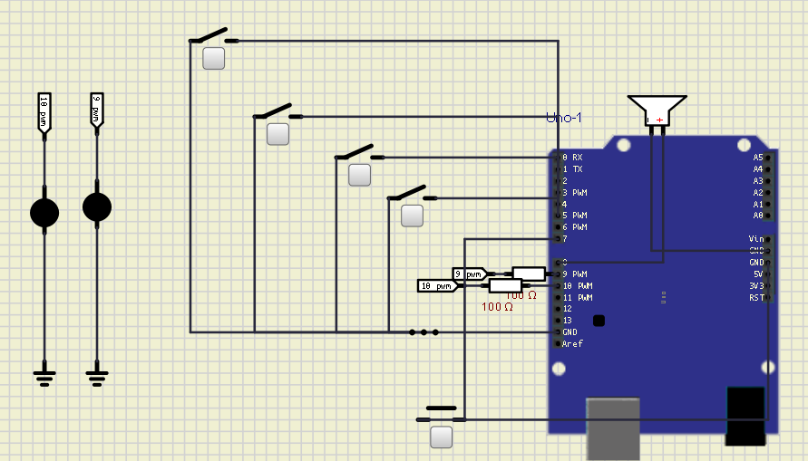

#  Projeto EGPR - Sistema de Segurança Comercial 

  Protótipo funcional de um sistema de alarme para portas e janelas, desenvolvido com Arduino UNO,
  sensores magnéticos (reed switch) e buzzer, totalmente simulado no SimulIDE.

 

<!-- Imagem do circuito -->

  

  <!-- Exemplo de imagem (troque quando tiver o arquivo) -->
  <!--  -->

---

## 📌 Descrição do Projeto

Este projeto tem como objetivo desenvolver um sistema de segurança simples, acessível e de fácil implementação,
voltado para ambientes comerciais e residenciais. O sistema emite um alarme ao detectar a abertura indevida de portas
ou janelas, utilizando sensores magnéticos e um buzzer. Todo o desenvolvimento foi realizado através do SimulIDE e Arduino IDE.

---

## 🎯 Objetivos

- Desenvolver a arquitetura do sistema utilizando microcontroladores.
- Criar o firmware em Arduino IDE para controle de sensores e atuadores.
- Simular o funcionamento completo do circuito no SimulIDE.
- Validar o comportamento do sistema com membros da comunidade.

---

## 🛠️ Tecnologias Utilizadas

  
  
  
  
  
  

---

## ⚙️ Arquitetura do Sistema

O sistema é baseado no microcontrolador Arduino UNO, utilizando sensores magnéticos (reed switch) para monitorar portas/janelas,
um buzzer para alarme sonoro e um LED indicador. Um botão permite armar e desarmar o sistema.

### **Fluxo de Funcionamento**
1. O sistema inicia desativado.  
2. O botão ativa ou desativa o alarme.  
3. Se ativado e o sensor detectar abertura:  
   - O buzzer dispara.  
   - O LED de status muda.  

---

## 📅 Cronograma do Projeto

| Atividade | Responsável | Prazo | Entrega |
|----------|-------------|--------|---------|
| Criação da pasta e grupo | Renylle | 18/08 – 08/09 | Organização inicial |
| Levantamento de requisitos | Guilherme | 08/09 – 15/09 | Documento de requisitos |
| Modelagem da arquitetura | Pamella e Renylle | 15/09 – 05/10 | Diagramas |
| Definição dos sensores/atuadores | Pamella e Guilherme | 01/10 – 08/10 | Lista definida |
| Programação do firmware | Pamella | 05/10 – 15/10 | Código-fonte |
| Simulação no SimulIDE | Pamella | 10/10 – 20/10 | Arquivo .simu |
| Registro de testes | Guilherme e Renylle | 15/10 – 22/10 | Relatório |
| Validação com a comunidade | Guilherme e Renylle | 20/10 – 25/10 | Feedback |
| Ajustes finais | Renylle e Pamella | 25/10 – 05/11 | Protótipo final |
| Relatório e apresentação | Equipe EGPR | 05/11 – 10/11 | Documentação |

---

## 👥 Equipe

- **Pamella Raquel** — Arquitetura, simulação e programação 
- **Renylle Rolim** — Relatórios, documentação 
- **Guilherme Apolonio** — Comunicação com a comunidade  

---

## 📊 Metas e Indicadores

- **Meta 1:** Protótipo funcional até 20/10  
  - Sistema arma/desarma e aciona buzzer corretamente  
- **Meta 2:** Validação com a comunidade até 25/10  
  - Mínimo de 70% de feedback positivo  
- **Meta 3:** Relatório final até 10/11  
  - Documentação validada pelo docente  

---

## 📁 Estrutura do Repositório (sugerida)

